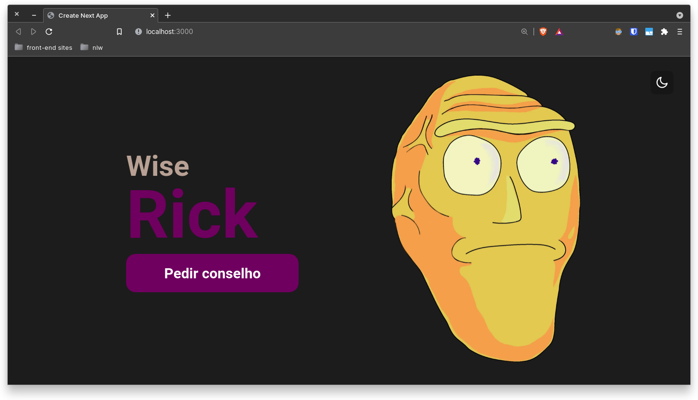

<h1 align="center">
Wise Rick
</h1>

## Screenshot

  

## Índice

* [Devchallenge](#devchallenge) 
* [Desafio](#desafio)
* [Techs](#techs)
* [Usage](#usage)

## Devchallenge
<a href="https://www.devchallenge.com.br/"> DevChallenge</a> permite que você evolua suas skills como programador! Participe da <a href="https://discord.gg/yvYXhGj">comunidade</a> o/

## Desafio

The challenge was: consume the data from two API's and create a website that generates advice and images of goats! (Note: the api that would provide the goat images is no longer on the air, so I changed the initial idea a little 👌) ... The inspiration model is available in the "design" folder.

## Techs

- [x] Next.js
- [x] React.js
- [x] TypeScript
- [x] Styled-Components

# Usage

## To just use:

Access [here]() !

## To manipulate the source code:

1. Run `npm install` or `yarn install`. 
2. Run `yarn dev` and access `http://localhost:3000`. 